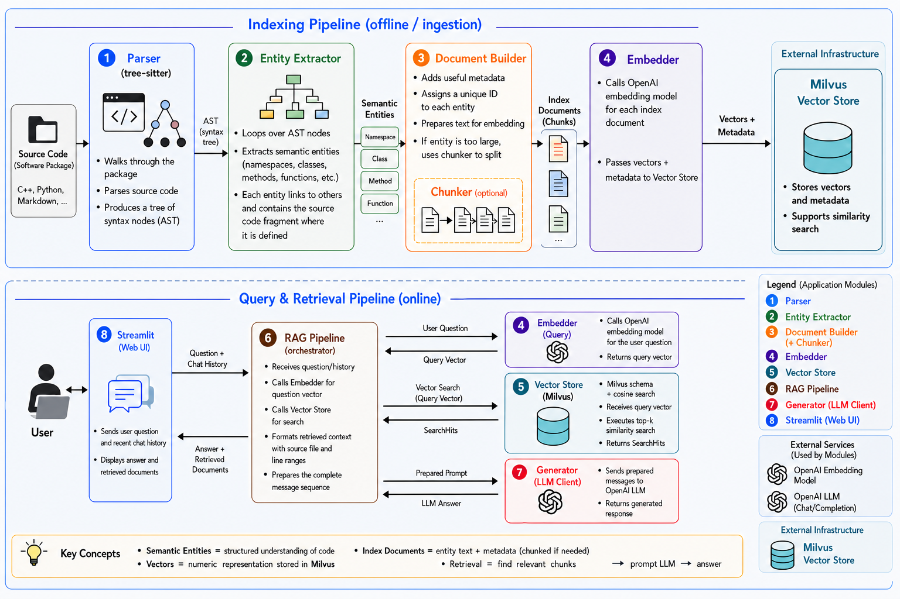

# CREST Knowledge Assistant

An AI-powered engineering assistant combining Retrieval-Augmented Generation (RAG), technical documentation retrieval, and source code understanding for scientific software projects.

## Overview

The CREST Knowledge Assistant is designed to help developers and users navigate the CERN ATLAS CREST ecosystem by providing intelligent access to documentation and source code through Large Language Models (LLMs).

The project integrates Retrieval-Augmented Generation (RAG), semantic search, and source code indexing to support:

* Technical documentation search
* Source code exploration and understanding
* AI-assisted software development
* Engineering knowledge retrieval

Although initially developed around the public ATLAS CREST repositories, the architecture is intended to be reusable for other scientific software projects.

## Architecture

The system consists of an offline indexing and ingestion pipeline and an online query and retrieval pipeline:



## Objectives

* Build a scalable RAG pipeline for technical documentation.
* Index source code repositories for semantic retrieval.
* Develop an AI assistant capable of answering engineering questions with citations.
* Evaluate retrieval quality and LLM performance using reproducible benchmarks.
* Apply modern LLMOps and software engineering practices.

## Technology Stack

* Python
* FastAPI
* Retrieval-Augmented Generation (RAG)
* Vector database
* Large Language Models (LLMs)
* Docker
* GitHub Actions

## Python code quality

Install development dependencies with `uv sync --locked`. Run the same Ruff
checks used by GitHub Actions before submitting changes:

```bash
uv run ruff check .
uv run ruff format --check .
```

To apply safe lint fixes (including import sorting) and format the code:

```bash
uv run ruff check --fix .
uv run ruff format .
```

Ruff targets Python 3.12 and checks project code, excluding external source data
and generated documents, indexes, and version metadata. Configuration lives in
`pyproject.toml`; the tool version is recorded in `uv.lock`. The Ruff workflow
runs on pull requests and pushes to `main`.

For feedback while editing in VS Code, install the **Ruff** extension
(`charliermarsh.ruff`) and select Ruff as the Python formatter. Enable format on
save if desired.

## Setup and Usage

Run the following commands from the project root in the order shown.

### Offline indexing and ingestion pipeline

The first three steps prepare the searchable knowledge base. Run them whenever the source data needs to be extracted and reindexed.

1. Extract semantic entities:

   ```bash
   uv run python src/crest_knowledge_assistant/extraction/semantic_entity_extractor.py
   ```

2. Create index documents:

   ```bash
   uv run python src/crest_knowledge_assistant/indexing/document_builder.py
   ```

3. Insert embeddings (vectors) into the vector database:

   ```bash
   uv run python src/crest_knowledge_assistant/indexing/indexer.py
   ```

### Online chat interface

After the offline pipeline has completed, start the Streamlit chat interface:

```bash
uv run streamlit run src/crest_knowledge_assistant/rag/crest_streamlit_app.py
```
