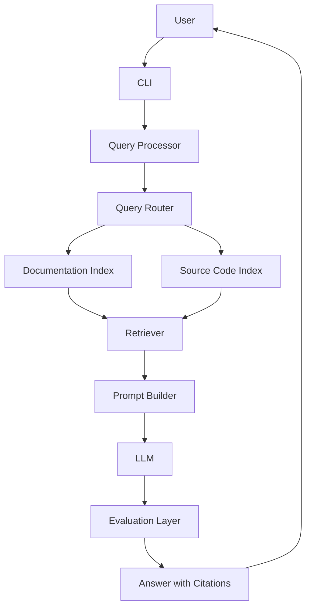

# Architecture

```mermaid
flowchart TD

    User[User]

    CLI[CLI]

    Query[Query Processor]

    Router[Query Router]

    Docs[Documentation Index]

    Code[Source Code Index]

    Retriever[Retriever]

    Prompt[Prompt Builder]

    LLM[LLM]

    Eval[Evaluation Layer]

    Answer[Answer with Citations]

    User --> CLI

    CLI --> Query

    Query --> Router

    Router --> Docs
    Router --> Code

    Docs --> Retriever
    Code --> Retriever

    Retriever --> Prompt

    Prompt --> LLM

    LLM --> Eval

    Eval --> Answer

    Answer --> User
```